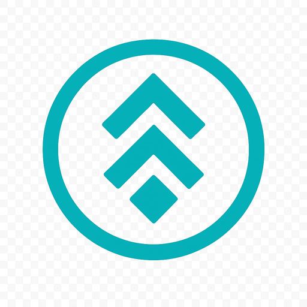

  

<h1 align="center">GameVinMon dApp</h1>

Swap VIN ↔ MON • Play Dice • On Monad Network

  
  
  
  

---

## 🚀 Live dApp  
👉 **https://gamevinmon.github.io/app**  
👉 **IPFS Link: https://ipfs.io/ipfs/bafybeifp5oka2nqvcv24yd23pfm2pasil3mzzjk3ng472j3gpqo3uq5kva**

---

# 🎯 Features

### 🔄 Swap VIN ↔ MON  
- Fixed rate: **1 VIN = 1 MON** (only while the pool still has liquidity)
- Auto balance detection  
- MAX button  
- Approve + Swap  
- Uses immutable swap contract:  
`0xCdce3485752E7a7D4323f899FEe152D9F27e890B`

### 🎲 On-chain Dice Game  
- Bet **VIN** on Even/Odd  
- 100% on-chain randomness using blockhash  
- No admin, no manipulation possible  
- Minimum bet: **0.01 VIN**  
- Dice contract:  
`0xE9Ed2c2987da0289233A1a1AE24438A314Ad6B2f`

### 💲 VIN price in USD  
Real-time price via CoinGecko API  
(1 VIN = 1 MON → fetch MON/USD)

### 🦊 Web3 & Wallet  
- MetaMask  
- Auto network check (Monad chain)  
- Error handling included

---

# 🔗 Smart Contracts

| Type | Address | Explorer |
|------|---------|----------|
| VIN Token | `0x09166bFA4a40BAbC19CCCEc6A6154d9c058098EC` | https://monadvision.com/token/0x09166bFA4a40BAbC19CCCEc6A6154d9c058098EC |
| Swap | `0xCdce3485752E7a7D4323f899FEe152D9F27e890B` | https://monadvision.com/address/0xCdce3485752E7a7D4323f899FEe152D9F27e890B |
| Dice | `0xE9Ed2c2987da0289233A1a1AE24438A314Ad6B2f` | https://monadvision.com/address/0xE9Ed2c2987da0289233A1a1AE24438A314Ad6B2f |

---

# 🗂️ Required Files (Download All)

To run the dApp correctly or host your own mirror, you must download **all files**, including images:

index.html
style.css
app.js
vinlogo.png
logo128.png
README.md

If any file is missing, the UI may not display correctly.

---

# 🛡️ Mirror & Backup Recommended

GameVinMon is a **fully on-chain, permissionless protocol**.  
The frontend (this repository) is *not required* for the protocol to function.

To ensure long-term survival, everyone is encouraged to **fork, mirror, or download** the entire repo and host their own version.

### Why mirror?
- Smart contracts are immutable  
- Liquidity cannot be withdrawn  
- No owner, no admin  
- Frontend can be hosted anywhere  
- If this repo disappears, the protocol still continues  

### How to mirror:
1. Click **Fork**  
2. Or download ZIP of the entire repository  
3. Upload to your GitHub and enable **GitHub Pages**  
4. Deploy `/index.html` as the homepage  
5. Done — connects instantly to the same contracts

### Where to host:
- GitHub Pages (recommended)  
- Cloudflare Pages  
- Vercel  
- Netlify  
- IPFS / Fleek / Pinata  
- Any static hosting

**More mirrors = stronger, censorship-resistant protocol.**

---

# 🧩 Project Structure

app/
├── index.html
├── style.css
├── app.js
├── vinlogo.png
├── logo128.png
└── README.md

---

# 🌐 Community  
- 🐦 Twitter: https://x.com/gamevinmon  
- 💬 Telegram: https://t.me/gamevinmon  
- 💻 GitHub: https://github.com/gamevinmon  

---

# 📜 License  
MIT License — free to use, fork, modify, and host.

© 2025 GameVinMon Protocol

